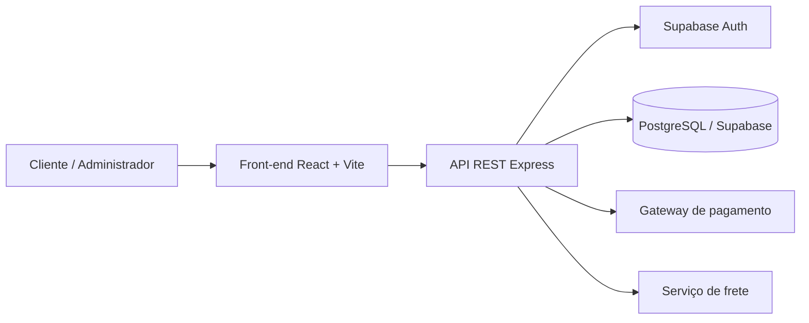
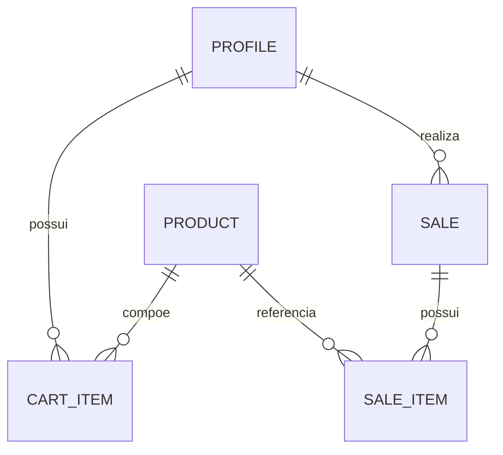
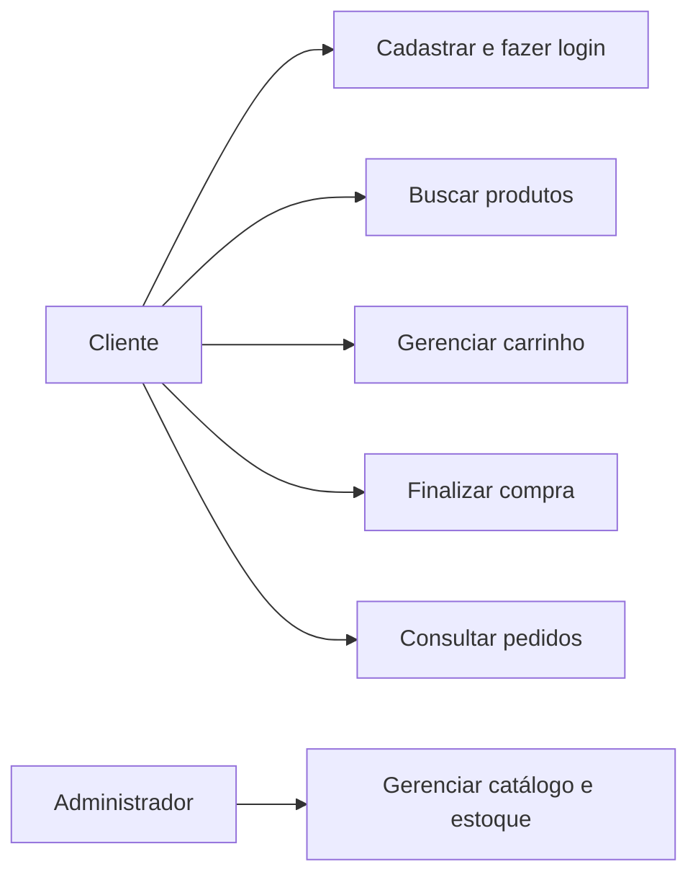
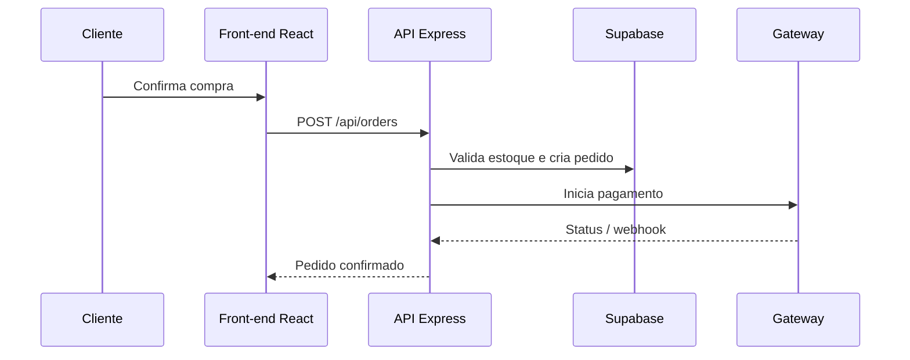

# Documentação - VELORA

## 1. Visão geral

VELORA é uma solução web de e-commerce básico. Seu objetivo é permitir a venda de produtos pela internet de forma rápida, organizada e segura.

- **Público-alvo:** clientes finais e administradores da loja.
- **Escopo:** catálogo, busca, autenticação, carrinho, checkout, pedidos e administração de produtos.
- **Limite do MVP:** o pagamento é demonstrativo; a estrutura está pronta para integrar um gateway certificado, como Mercado Pago ou Stripe.

## 2. Requisitos

### Requisitos funcionais

| ID | Requisito | Implementação |
| --- | --- | --- |
| RF01 | Criar conta e fazer login. | `POST /api/auth/register` e `POST /api/auth/login` |
| RF02 | Buscar produtos por nome ou categoria. | `GET /api/products?q=&category=` |
| RF03 | Adicionar itens ao carrinho e finalizar compra. | Rotas `/api/cart`, `/api/checkout` e `/api/orders` |
| RF04 | Administrar produtos, preços e estoque. | `POST`, `PUT` e `DELETE /api/products` protegidos por papel de admin |
| RF05 | Consultar pedidos realizados. | `GET /api/orders` e `GET /api/orders/:id` |

### Requisitos não funcionais

| ID | Requisito | Estratégia |
| --- | --- | --- |
| RNF01 | Carregamento em menos de 3 segundos. | React/Vite, imagens WebP, paginação e API REST enxuta. |
| RNF02 | Disponibilidade de 99,9%. | Depende da hospedagem e monitoramento do ambiente produtivo. |
| RNF03 | Segurança e privacidade. | Supabase Auth, token Bearer, RLS e segredos somente no back-end. |
| RNF04 | LGPD e PCI-DSS. | O sistema não armazena cartões; um gateway certificado deve processar pagamentos reais. |

## 3. Arquitetura

O projeto usa uma arquitetura em três camadas, com a API REST como ponto de entrada único.

| Camada | Tecnologia | Responsabilidade |
| --- | --- | --- |
| Apresentação | React + Vite | Navegação, catálogo, perfil, carrinho e checkout. |
| Regras de negócio | Node.js + Express | API, validações, autorização, pedidos, frete e webhook. |
| Dados | Supabase / PostgreSQL | Produtos, perfis, carrinhos, pedidos, itens e autenticação. |
| Integrações | Gateway de pagamento e frete | Recebe status de pagamento e calcula opções de envio. |

## 4. Modelagem de dados

| Entidade | Campos principais |
| --- | --- |
| Usuário/Perfil | id, nome, e-mail, telefone, endereço, role |
| Produto | id, nome, descrição, preço, estoque, categoria, imagem, active |
| Carrinho/Item | customer_id, product_id, quantidade, tamanho, cor |
| Pedido | id, customer_id, data, status, valor total, frete, pagamento |
| Item do pedido | sale_id, product_id, quantidade, preço unitário |

## 5. Casos de uso

## 6. Sequência da compra

## 7. Segurança

- Rotas privadas exigem token Bearer validado pelo Supabase Auth.
- Operações administrativas verificam o papel `admin` do perfil.
- RLS limita perfis, carrinhos e pedidos ao próprio usuário.
- O webhook de pagamento exige segredo configurado somente no back-end.
- A RPC `create_sale` valida estoque, preço e frete antes de registrar a venda.
